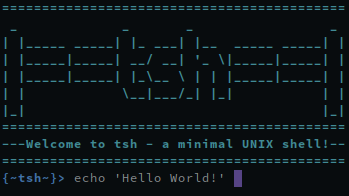

## tsh

Minimal Unix Shell for learning purposes

### Dependencies
* readline (optional)

### Installing
* install tsh with `sudo make install`
* uninstall with `sudo make uninstall`

### Configuration
custom configuration can be set in [config.h](config.h)
for information about ANSI color codes, see [COLORS.md](COLORS.md)

