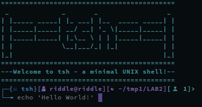

## tsh - Minimal Unix Shell for learning purposes

### Dependencies
* readline (optional)

### Installing
* install `tsh` with `sudo make install`
* uninstall with `sudo make uninstall`

### Making an archive
* make .tar.gz with `make dist`

### Configuration
* custom configuration can be set in [config.h](config.h)
* for information about ANSI color codes, see [COLORS.md](COLORS.md)

### Questions during work submission
* Why my shell exits after the command "cat -n &", while bash does not.
* What exactly does `tcsetpgrp(STDIN_FILENO, getpid());` do and why there is no apparent change in behaviour after commenting out this line. Also, same with `tcsetpgrp(STDIN_FILENO, getpid());`
